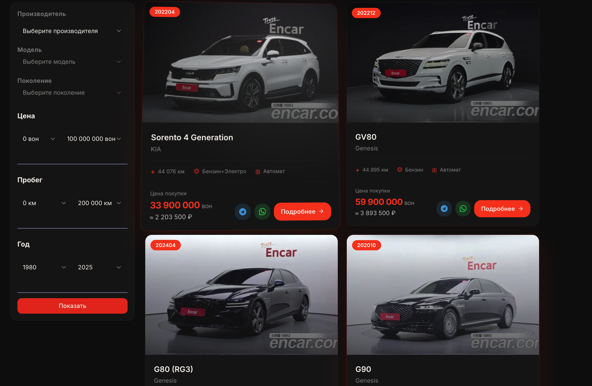
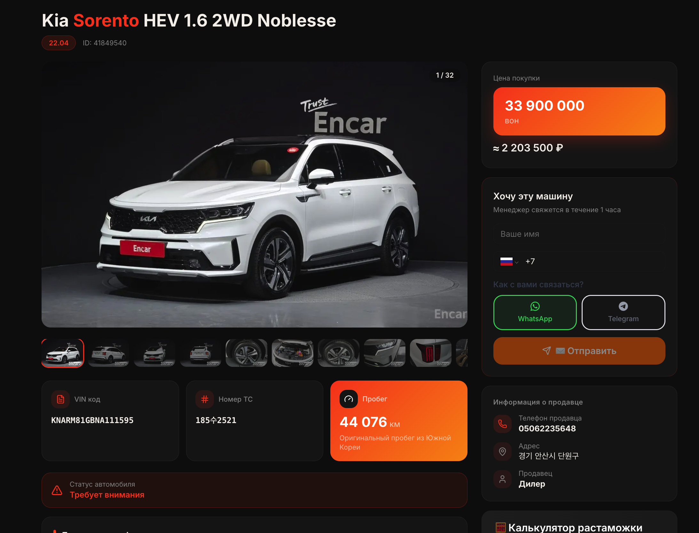
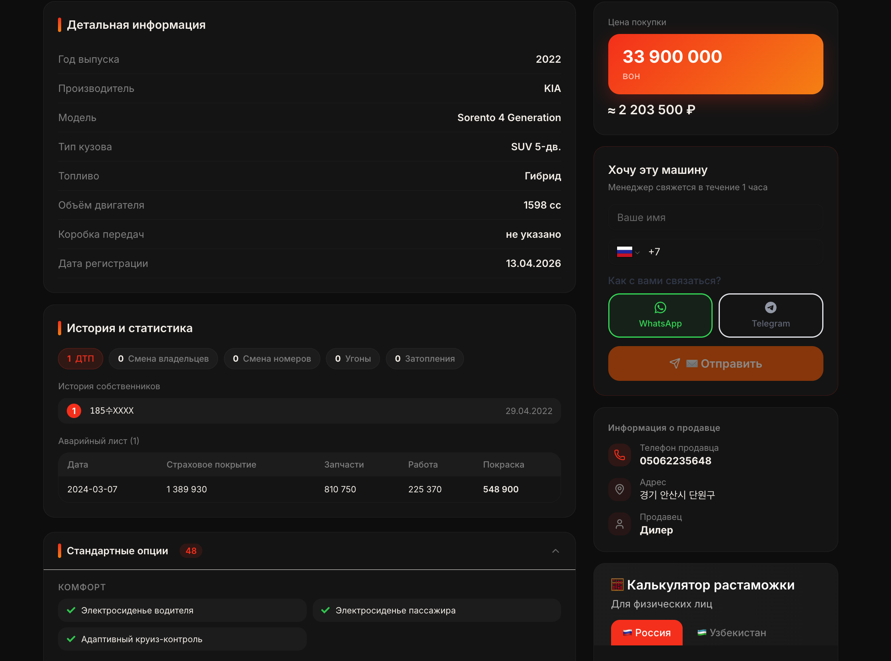
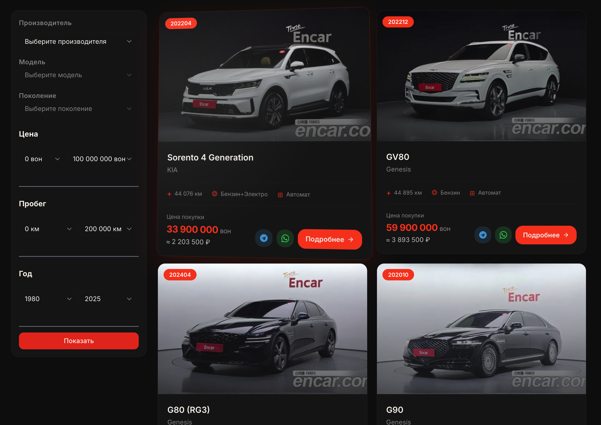

# KMotors — Korean Used Car Export Platform

> Full-stack web application for a licensed Korean used car dealership. Integrates with the Encar marketplace API, supports multilingual content, and includes a customs duty calculator for export markets.

**Live site:** [kmotors.shop](https://kmotors.shop)

---

## Screenshots






---

## Features

- **Car catalog** — real-time data from Encar API with filters by brand, price, year, and mileage
- **Car detail pages** — photo gallery, full spec sheet, VIN lookup, Korean license plate validation
- **Customs calculator** — duty estimation for Russia and Uzbekistan based on engine volume, age, and price
- **Blog** — markdown-based articles with RSS auto-sync via Vercel cron jobs
- **Multilingual** — Russian, English, Korean (i18n with `react-i18next`)
- **Telegram integration** — webhook-based notifications
- **Admin panel** — protected route with JWT auth for content management
- **SEO** — dynamic sitemaps for catalog, blog, and static pages

---

## Tech Stack

| Layer | Technology |
|---|---|
| Framework | Next.js 15 (App Router) |
| Language | TypeScript |
| Styling | Tailwind CSS + shadcn/ui + Radix UI |
| Database | Supabase (PostgreSQL) |
| Auth | JWT + bcrypt |
| i18n | react-i18next |
| Deployment | Vercel |
| External API | Encar.com (Korean car marketplace) |

---

## Getting Started

### Prerequisites

- Node.js 18+
- Supabase project ([supabase.com](https://supabase.com))

### Installation

```bash
git clone https://github.com/Nikolanikol/KMotors.git
cd KMotors
npm install
```

### Environment Variables

Create `.env.local` in the root directory:

```env
# Supabase
NEXT_PUBLIC_SUPABASE_URL=your_supabase_url
NEXT_PUBLIC_SUPABASE_ANON_KEY=your_supabase_anon_key
SUPABASE_SERVICE_ROLE_KEY=your_service_role_key

# Auth
JWT_SECRET=your_jwt_secret
ADMIN_PASSWORD_HASH=your_bcrypt_hash

# Telegram (optional)
TELEGRAM_BOT_TOKEN=your_bot_token
TELEGRAM_CHAT_ID=your_chat_id

# Exchange rate API (optional)
EXCHANGE_RATE_API_KEY=your_api_key
```

### Run

```bash
npm run dev
```

Open [http://localhost:3000](http://localhost:3000)

---

## Project Structure

```
src/
├── app/                  # Next.js App Router pages & API routes
│   ├── api/              # REST endpoints (blog, exchange rate, telegram, etc.)
│   ├── catalog/          # Car listing & detail pages
│   ├── blog/             # Blog with dynamic slugs
│   ├── admin/            # Protected admin panel
│   └── parts/            # Spare parts section
├── components/           # UI components by feature
├── utils/
│   └── customsCalculator/ # Duty calculation logic (Russia, Uzbekistan)
├── locales/              # i18n translations (ru, en, ko)
└── lib/                  # Supabase client, i18n config
```

---

## Customs Calculator

Calculates import duties based on:
- Vehicle age
- Engine displacement (cc)
- Price in KRW/USD

Supports export markets: **Russia**, **Uzbekistan**

---

## Deployment

The project is deployed on Vercel. A cron job runs daily at 09:00 UTC to sync the blog RSS feed:

```json
{
  "crons": [{ "path": "/api/rss-sync", "schedule": "0 9 * * *" }]
}
```

---

## License

Private commercial project. All rights reserved.
